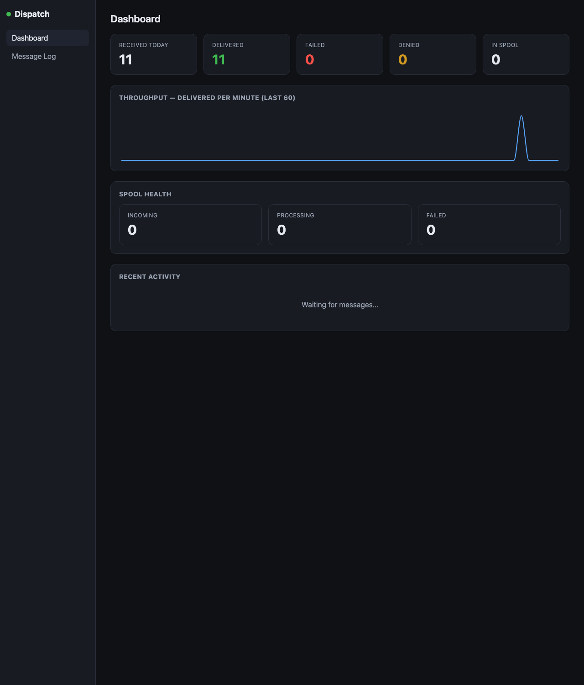

<div align="center">

# Dispatch SMTP Relay

**Open-source .NET SMTP relay - forward mail from your apps to any cloud provider**

[](https://github.com/chrismuench/Dispatch-SMTP-Relay/actions)
[](LICENSE)
[](https://github.com/chrismuench/Dispatch-SMTP-Relay/releases/latest)
[](https://chrismuench.github.io/Dispatch-SMTP-Relay/deployment/overview/)

Point your applications and devices at Dispatch over **SMTP** (the standard ports **25** and **587** by default - it falls back to **2525** only if 25 is already taken) or a Mailgun-compatible **HTTP API**. Dispatch queues every message durably and forwards it to a dozen providers - Mailgun, SendGrid, Amazon SES, Postmark, Resend, SparkPost, SMTP2GO, Maileroo, Bird, Azure Communication Services - or any SMTP smart host, with a live web dashboard to monitor, configure, and troubleshoot everything.

### 📚 **[Read the documentation →](https://chrismuench.github.io/Dispatch-SMTP-Relay/)**



</div>

---

## Why Dispatch?

Most applications need to send email. Wiring every app directly to a cloud provider means scattered credentials, no central log, and no fallback when a provider has an outage. Dispatch sits in the middle:

```
Your apps / devices  →  Dispatch SMTP (port 25/587)   ─┐
                                                         ├→  Mailgun / SendGrid / Azure / SMTP …
Your apps / scripts  →  Dispatch API  (port 8025)      ─┘
         ↑                       ↕
    202 / 250 OK instantly   spool directory
    (before any DB or        (durable in-flight queue)
     network call)                  ↕
                              relay_log in SQL
                              (after-the-fact history)
                                    ↕
                             Web UI (port 8420)
                         Configure · Monitor · Debug
```

- **`250 OK` before anything else** - Dispatch writes the message to a local spool file and acknowledges the sender immediately. SQL Server is written to only *after* the provider accepts the message.
- **The spool directory is the queue** - `.eml` files survive restarts, crashes, and SQL outages. If SQL is down, mail still flows.
- **One place for credentials** - rotate an API key once, not in every app.
- **Test before you commit** - verify provider credentials with a live relay log, or capture mail to the **Local Inbox** without delivering anything.

## Features

- **Two ways in** - SMTP (STARTTLS, optional AUTH) and a Mailgun-compatible HTTP/HTTPS API with per-key tokens.
- **A dozen providers** - Mailgun, SendGrid, Amazon SES, Postmark, Resend, SparkPost, SMTP2GO, Maileroo, Bird, Azure Communication Services, generic SMTP - plus **Local** capture mode. CC/BCC, attachments, and custom headers everywhere.
- **[Local Inbox](https://chrismuench.github.io/Dispatch-SMTP-Relay/sending/local-inbox/)** - a built-in mail trap: capture and inspect what your app sends, without delivering anything. Great for development and CI.
- **Durable spool** - instant `250 OK`, auto-retry with back-off, retry-from-UI for failures.
- **Smart routing** - send by sender/recipient domain to different relays, with a catch-all default and a simulate tool.
- **Live dashboard** - real-time counters, a searchable message log with sandboxed HTML preview, reports, and one-click provider testing.
- **Secure by default** - HTTPS-only dashboard, a shared TLS cert for SMTP + the API, bcrypt-hashed passwords & API keys, encrypted secrets at rest, CIDR allow-lists so it's never an open relay.
- **Observability** - unauthenticated `/health` and Prometheus `/metrics` (dashboard-port, allow-list-gated).
- **Deploy anywhere** - Windows & Linux installers (bundled SQL), a multi-arch Docker image, or a ready-to-import virtual appliance for Hyper-V, VMware, KVM & Proxmox.

## Quickstart

The fastest way to try Dispatch is Docker Compose - it brings up Dispatch **and** its database together:

```bash
git clone https://github.com/chrismuench/Dispatch-SMTP-Relay.git
cd Dispatch-SMTP-Relay
docker compose up -d --build
# dashboard → https://localhost:8420  (self-signed cert; default login password in docker-compose.yml)
```

Then open **https://localhost:8420**, set the admin password, add a relay, and point your apps at `localhost:25` (SMTP) or `localhost:8025` (HTTP API).

> **Tip:** Dispatch listens on the standard SMTP ports **25** and **587**. Install it on a host with **no other SMTP software** (Postfix, Sendmail, Exim, …) so those ports are free - otherwise Dispatch falls back to **2525**.

➡️ Full guide: **[Quickstart](https://chrismuench.github.io/Dispatch-SMTP-Relay/start/quickstart/)** · **[How it works](https://chrismuench.github.io/Dispatch-SMTP-Relay/start/how-it-works/)**

## Documentation

Everything lives on the docs site: **https://chrismuench.github.io/Dispatch-SMTP-Relay/**

| | |
|---|---|
| **[Deployment](https://chrismuench.github.io/Dispatch-SMTP-Relay/deployment/overview/)** | Docker, Linux, Windows, and the virtual appliance |
| **[Relay providers](https://chrismuench.github.io/Dispatch-SMTP-Relay/providers/overview/)** | Per-provider setup and settings |
| **[Sending mail](https://chrismuench.github.io/Dispatch-SMTP-Relay/sending/smtp/)** | SMTP, HTTP API, Local Inbox, message features |
| **[Routing](https://chrismuench.github.io/Dispatch-SMTP-Relay/routing/)** | Route by sender/recipient domain |
| **[Configuration](https://chrismuench.github.io/Dispatch-SMTP-Relay/configuration/overview/)** | Settings model + full config-key reference |
| **[Security](https://chrismuench.github.io/Dispatch-SMTP-Relay/security/)** | Auth, access control, encryption, TLS |
| **[API reference](https://chrismuench.github.io/Dispatch-SMTP-Relay/reference/api/)** | The HTTP ingestion API |

## Security

Safe by default: the dashboard is HTTPS-only, secrets are encrypted at rest (AES-256-GCM with a portable, access-restricted key file on every platform - so a database backup can be restored on another machine by also restoring the key file), passwords and API keys are bcrypt-hashed, and SMTP + the API are closed to anything outside private ranges so a fresh install is never an open relay. Full details: **[Security docs](https://chrismuench.github.io/Dispatch-SMTP-Relay/security/)**. Please report vulnerabilities privately via [GitHub Security Advisories](https://github.com/chrismuench/Dispatch-SMTP-Relay/security/advisories/new).

## Building from source

Prerequisites: the **.NET 10 SDK**, **Node.js 20+**, and **Docker** (for SQL).

```bash
git clone https://github.com/chrismuench/Dispatch-SMTP-Relay.git
cd Dispatch-SMTP-Relay
docker compose up -d                       # SQL (Azure SQL Edge); schema auto-created on first run
cd src/Dispatch.UI && npm install && npm run build && cd ../..
rm -rf src/Dispatch.Web/wwwroot && mkdir -p src/Dispatch.Web/wwwroot
cp -r src/Dispatch.UI/dist/* src/Dispatch.Web/wwwroot/
ASPNETCORE_ENVIRONMENT=Development dotnet run --project src/Dispatch.Service
```

`appsettings.Development.json` (git-ignored) needs at least the SQL connection string and an `AdminPassword`. Tests: `dotnet test` (Data integration tests run only when `DISPATCH_TEST_SQL` is set, auto-skipped otherwise). The docs site lives in [`website/`](website/) (Astro + Starlight).

## Contributing

Contributions are welcome - see [CONTRIBUTING.md](CONTRIBUTING.md). **Adding a provider:** implement `IRelayProvider` in `Dispatch.Providers` (see `SendGridProvider.cs`), wire it into `RelayProviderFactory`, add the UI fields and tests. Good first issues are [labelled in the tracker](https://github.com/chrismuench/Dispatch-SMTP-Relay/issues?q=label%3A%22good+first+issue%22).

## Licence

AGPL-3.0 with Commons Clause - see [LICENSE](LICENSE). You may use, self-host, modify, and contribute back; you may **not** sell Dispatch, charge for a hosted version, or ship it inside a paid product. See the [licence FAQ](https://chrismuench.github.io/Dispatch-SMTP-Relay/project/license/).
